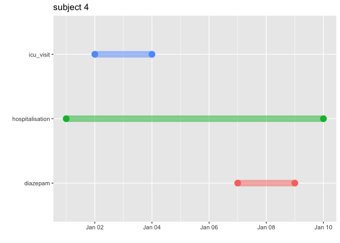

<!-- README.md is generated from README.Rmd. Please edit that file -->

# TestGenerator

<!-- badges: start -->

[](https://github.com/darwin-eu/TestGenerator/actions/workflows/R-CMD-check.yaml)
[](https://app.codecov.io/github/darwin-eu/TestGenerator?branch=main)
[](https://CRAN.R-project.org/package=TestGenerator)
<!-- badges: end -->

Does my cohort picked the correct number patients? Am I calculating an
intersection in the right way? Is that the expected value for treatment
duration? It just takes one incorrect parameter to get incoherent
results in a pharmacoepidemiological study, and it is very challenging
to test calculations on huge and complex databases.

That is why TestGenerator is useful to push a small sample of patients
to unit test a study on the OMOP-CDM. It includes tools to create a
blank CDM with a complete vocabulary and check if the code is doing what
we expect in very specific cases.

This package is based on the unit testing written for the [Eramus MC
Ranitidine
Study](https://github.com/mi-erasmusmc/RanitidineStudy/blob/master/unitTesting_README.md).

## Installation

To install TestGenerator:

``` r
# CRAN version

install.packages("TestGenerator")
```

## Example

The user can provide an Excel file [(link to
sample)](https://github.com/darwin-eu/TestGenerator/raw/main/inst/extdata/icu_sample_population.xlsx)
or a set of CSV files that represent tables of the OMOP-CDM, with a
micro population of just 8 patients for testing purposes.

`readPatients()` will read either Excel or CSVs, and then saves the data
in a JSON file. This is useful if the user wants to create more than one
Unit Test Definitions. If the parameter `outputPath` is `NULL` The files
are saved in the `testthat/testCases` folder of the package. Alterna

``` r
TestGenerator::readPatients(filePath = "~/pathto/testPatients.xlsx",
                            testName = "test",
                            outputPath = NULL,
                            cdmVersion = "5.3")
```

Alternatively, the user can use the functions `readPatients.xl` or
`readPatients.csv` directly.

``` r
TestGenerator::readPatients.xl(filePath = "~/pathto/testPatients.xlsx",
                               testName = "test",
                               outputPath = NULL,
                               cdmVersion = "5.3")

TestGenerator::readPatients.csv(filePath = "~/pathto/csv/files",
                                testName = "test",
                                outputPath = NULL,
                                cdmVersion = "5.3",
                                reduceLargeIds = FALSE)
```

`patientCDM()` pushes one of those Unit Test Definitions into a blank
CDM reference with a complete version of the vocabulary. If the
`pathJSON` parameter is `NULL`, `TestGenerator` will look for the JSON
test files in the `testthat/testCases` folder.

``` r
cdm <- TestGenerator::patientsCDM(pathJson = NULL, 
                                  testName = "test",
                                  cdmVersion = "5.3")
```

Now the user has a CDM reference with a complete vocabulary and just 8
patients.

``` r
filePath <- system.file("extdata/icu_sample_population.xlsx", 
                        package = "TestGenerator")

outputPath <- file.path(tempdir(), "test")

dir.create(outputPath)

TestGenerator::readPatients(filePath = filePath, 
                            testName = "test", 
                            outputPath = outputPath, 
                            cdmVersion = "5.3")
#> ✔ Unit Test Definition Created Successfully: 'test'
cdm <- TestGenerator::patientsCDM(pathJson = outputPath, 
                                  testName = "test",
                                  cdmVersion = "5.3")
#> Note: method with signature 'DBIConnection#Id' chosen for function 'dbExistsTable',
#>  target signature 'duckdb_connection#Id'.
#>  "duckdb_connection#ANY" would also be valid
#> ! cdm name not specified and could not be inferred from the cdm source table
#> ✔ Patients pushed to blank CDM successfully

cdm[["person"]] %>% glimpse()
#> Rows: ??
#> Columns: 18
#> Database: DuckDB v1.1.0 [root@Darwin 24.0.0:R 4.4.1//private/var/folders/ny/8mfpdl611hz7by4z_3kfl3t00000gn/T/RtmpJcD0I4/file1161b10365d9c.duckdb]
#> $ person_id                   <int> 1, 2, 3, 4, 5, 6, 7, 8
#> $ gender_concept_id           <int> 8532, 8507, 8532, 8507, 8532, 8507, 8532, …
#> $ year_of_birth               <int> 1980, 1990, 2000, 1980, 1990, 2000, 1980, …
#> $ month_of_birth              <int> NA, NA, NA, NA, NA, NA, NA, NA
#> $ day_of_birth                <int> NA, NA, NA, NA, NA, NA, NA, NA
#> $ birth_datetime              <dttm> NA, NA, NA, NA, NA, NA, NA, NA
#> $ race_concept_id             <int> 0, 0, 0, 0, 0, 0, 0, 0
#> $ ethnicity_concept_id        <int> 0, 0, 0, 0, 0, 0, 0, 0
#> $ location_id                 <int> 0, 0, 0, 0, 0, 0, 0, 0
#> $ provider_id                 <int> 0, 0, 0, 0, 0, 0, 0, 0
#> $ care_site_id                <int> 0, 0, 0, 0, 0, 0, 0, 0
#> $ person_source_value         <chr> "0", "0", "0", "0", "0", "0", "0", "0"
#> $ gender_source_value         <chr> "M", "F", "M", "F", "M", "F", "M", "F"
#> $ gender_source_concept_id    <int> NA, NA, NA, NA, NA, NA, NA, NA
#> $ race_source_value           <chr> NA, NA, NA, NA, NA, NA, NA, NA
#> $ race_source_concept_id      <int> NA, NA, NA, NA, NA, NA, NA, NA
#> $ ethnicity_source_value      <chr> NA, NA, NA, NA, NA, NA, NA, NA
#> $ ethnicity_source_concept_id <int> NA, NA, NA, NA, NA, NA, NA, NA
```

The reference can be used to create a cohort and create unit tests.

``` r
test_cohorts <- system.file("extdata",
                            "test_cohorts",
                            package = "TestGenerator")

cohort_set <- CDMConnector::readCohortSet(test_cohorts)
  
cdm <- CDMConnector::generate_cohort_set(cdm,
                                         cohort_set,
                                         name = "test_cohorts")
#> ℹ Generating 3 cohorts
#> ℹ Generating cohort (1/3) - diazepam
#> ✔ Generating cohort (1/3) - diazepam [192ms]
#> 
#> ℹ Generating cohort (2/3) - hospitalisation
#> ✔ Generating cohort (2/3) - hospitalisation [195ms]
#> 
#> ℹ Generating cohort (3/3) - icu_visit
#> ✔ Generating cohort (3/3) - icu_visit [54ms]
#> 
#> Warning: ! 5 casted column in test_cohorts (cohort_attrition) as do not match expected
#>   column type:
#> • `number_records` from numeric to integer
#> • `number_subjects` from numeric to integer
#> • `reason_id` from numeric to integer
#> • `excluded_records` from numeric to integer
#> • `excluded_subjects` from numeric to integer
#> Warning: ! 1 column in test_cohorts do not match expected column type:
#> • `subject_id` is numeric but expected integer

cohortAttrition <- CDMConnector::attrition(cdm[["test_cohorts"]])
  
excluded_records <- cohortAttrition %>% 
    pull(excluded_records) %>% 
    sum()
  
expect_equal(excluded_records, 0)
```

With `graphCohort()` it is possible to visualise the timeline for
particular patient.

``` r

diazepam <- cdm[["test_cohorts"]] %>% 
  filter(cohort_definition_id == 1) %>% 
  collect()

hospitalisation <- cdm[["test_cohorts"]] %>% 
  filter(cohort_definition_id == 2) %>% 
  collect()

icu_visit <- cdm[["test_cohorts"]] %>% 
  filter(cohort_definition_id == 3) %>% 
  collect()

TestGenerator::graphCohort(subject_id = 4, list("diazepam" = diazepam,
                                                "hospitalisation" = hospitalisation,
                                                "icu_visit" = icu_visit))
#> Warning in geom_segment(aes(x = cohort_start_date, y = cohort, xend =
#> cohort_end_date, : Ignoring unknown aesthetics: fill
```


